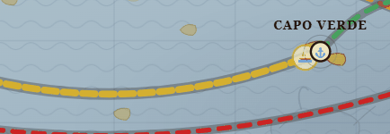
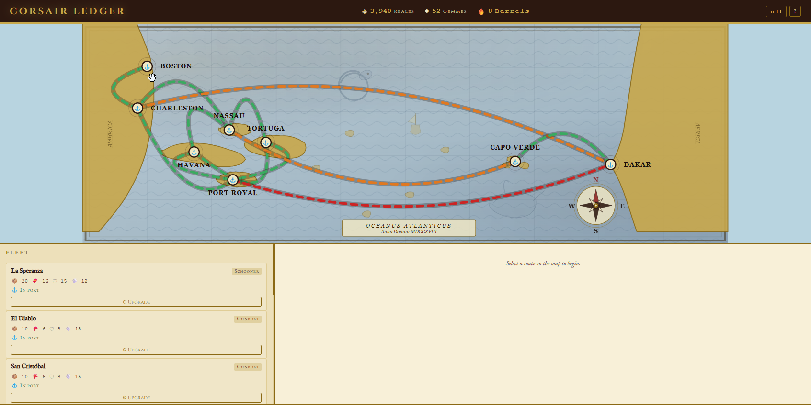

# ⚓ Corsair Ledger

> *While we wait for AC: Black Flag Resynced…*

A standalone browser mini-game inspired by **Kenway's Fleet** from *Assassin's Creed: Black Flag*. No install, no login, no framework — just open `index.html` and sail.

**▶ [Play live on GitHub Pages](https://danilomagro.github.io/corsair-ledger/)**

---

## Features

- 🗺 **Interactive parchment map** — zoom, pan, click routes (scroll/pinch/drag)
- ⛵ **Animated ships** sailing bezier curves in real time
- 🔒 **12 trade routes** across 4 zones — Caribbean, American Coast, Atlantic crossing, West Africa — unlocked progressively
- ⚔ **Combat system** — fleet power vs enemy strength, fire barrels, damage/repair
- 🏴 **Ship capture** — enemy vessels can join your fleet after successful missions
- 🏪 **Shipyard** — buy/sell 5 ship types (Gunboat → Man O' War) + per-stat upgrades
- 💰 **Three resources** — Reales, Gems, Cargo (Tobacco · Wine · Cocoa)
- 🇮🇹 🇬🇧 **Italian / English** — language toggle in the header
- 💾 **Auto-save** (localStorage) + JSON export/import

---

## How to play

1. **Clone or download** the repo
2. Open `index.html` in any modern browser (Chrome, Firefox, Edge, Safari)
3. Click a **green route** on the map to start — Nassau → Havana is a good first step
4. Pick a **mission**, assign **ships**, hit **Launch**
5. Collect your loot when the timer expires — then expand your trade empire

> **Tip:** Win battles to reduce a route's danger level and earn better rewards.  
> **Tip:** Faster ships (Gunboat/Schooner) shorten travel time; heavier ones (Frigate/Man O' War) win fights.

---

## Stack

| File | Role |
|------|------|
| `index.html` | Markup, Open Graph meta, manual overlay |
| `style.css` | All styling (CSS variables, parchment theme) |
| `js/game.js` | Game logic + SVG renderer — **single file, no build step** |

Works via `file://` — no server needed.

---

## Screenshot

---

## Roadmap / Known limitations

- Mobile: playable but detail panels are cramped on small screens
- No server component — all state lives in `localStorage` (one save per browser)
- Mission names are in English; port descriptions in Italian (mixed intentionally — lore flavour)

---

## Contributing

Bug reports, balance feedback, and pull requests are welcome.  
This is a passion project — keep the spirit of the Jackdaw alive. 🏴‍☠️

---

## License

MIT — free to use, fork, and build upon.

---

*"I'm not a man who was meant to be caged."*  
— Edward Kenway
